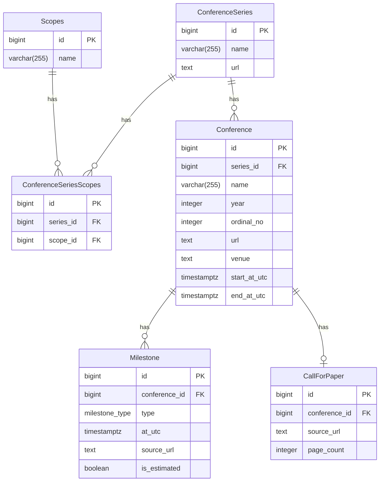

# 0001 Data Model

## Context

会議情報を管理するためのデータモデルを定義する。
対象要件は次の通り。

- 年1回開催と年複数回開催を同じ構造で扱えること
- CfP がある会議とない会議の両方を扱えること
- 開催期間と締切のような時点情報を分離して扱えること
- 情報源 URL を根拠として保持できること
- 分類（Scope）でシリーズを横断的に絞り込めること

## Decision Log

- `Series -> Conference` を採用
  - 年 1 回開催の会議と複数回開催される会議を同じ構造で扱うため
- `Conference` と `CallForPaper` は `0 or 1` 関係にする
  - 会議によって Call for Paper が存在しないケースを許容するため
- `ConferenceSeries` ではなく、`Conference` が `CallForPaper` を所有する
  - Call for Paper の情報源 (`source_url`) を会議ごとに保持できるようにするため
- `Milestone.is_estimated` を採用
  - スケジューリングのために未公開の締め切りを推定することが求められるケースがあるため
  - is_estimated が true の場合は、source_url は過去会議のウェブサイトへの URL になる

### ER Diagram

### Unique Constraints

- `CallForPaper(conference_id)`
- `ConferenceSeriesScopes(series_id, scope_id)`

## Consequences

- CfP がない会議・CfP 未公開会議・CfP 公開済み会議を同じモデルで扱える。
- 開催期間は `Conference` で直接管理し、`Milestone` は締切などの単一日時イベントに集中できる。
