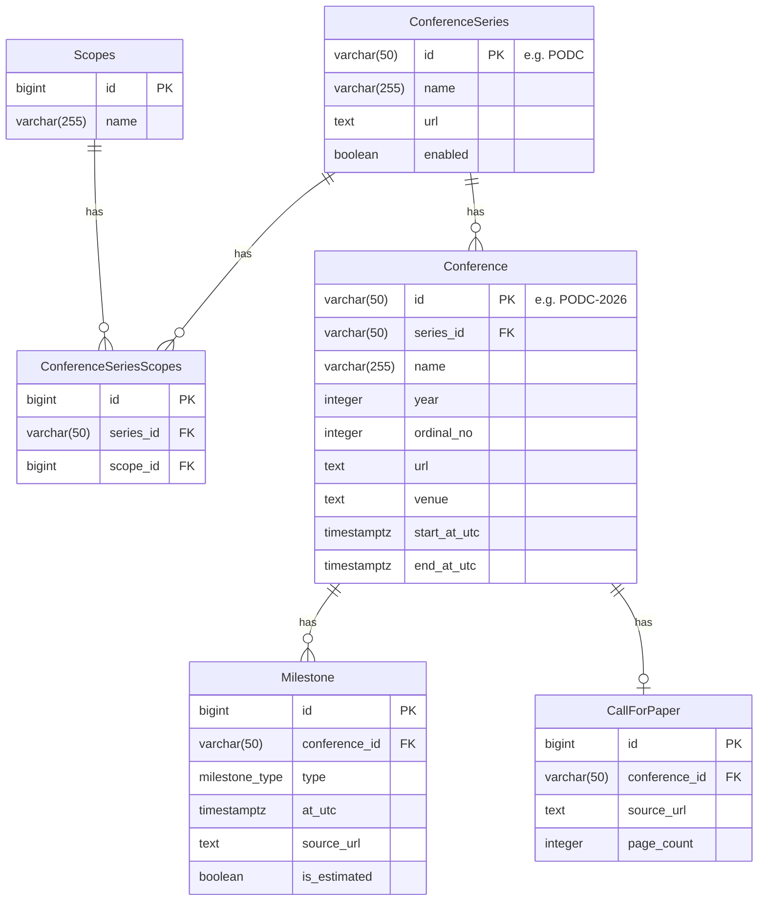

# 0002 Data Ingestion & Update Strategy

## Context

0001 で定義したデータモデル（`ConferenceSeries`, `Conference`, `Milestone`, `CallForPaper` など）を**継続的に更新**していく仕組みが必要である。

情報源は大きく 2 種類ある。

| 情報源              | 説明                                  | 特徴                                         |
| ------------------- | ------------------------------------- | -------------------------------------------- |
| **人間**            | 手動入力・レビュー・修正              | 正確だが頻度が低い。最終的な承認権を持つ     |
| **AI エージェント** | tiny-serp → クローリング → LLM パース | 高頻度で取得できるが、誤りを含む可能性がある |

設計上の目標は次の通り。

1. **変更履歴の追跡** — Git コミット履歴で十分であり、DB レベルの provenance テーブルは導入しない
2. **レビュー可能性** — AI エージェントが提案した変更は confidence が低い場合に PR として作成し、人間が承認するフローとする
3. **冪等な取り込み** — 同一ソースから同じ情報を複数回取得しても重複・競合が発生しないこと
4. **適切なタイミングでの更新** — 未来の会議情報をいつ取得・推定・更新すべきかの戦略を定義する
5. **段階的な自動化** — 将来的には人間の承認なしに自動更新できる構成を目指す

### スコープ外

- AI エージェントの内部実装（tiny-serp, クローラー, LLM パーサーの詳細）
- フロントエンド UI 設計
- 認証・認可
- 実行頻度・時間帯の決定（運用で調整する）

## Decision Log

### 1. ストレージは JSON ファイル + Git を採用する

RDBMS は導入せず、フラットファイル + Git で管理する。変更履歴は Git のコミット履歴で追跡する。

- `ConferenceSeries` — CSV（`config/conferences.csv`）。ほぼ静的なマスターデータのため、テーブル形式が自然
- `Conference`, `Milestone`, `CallForPaper` — JSON（`data/conferences.json`）。ネストした構造を持つためJSON が適している

**理由:**

- 現時点でのデータ規模（数十シリーズ × 数年分）では RDBMS のメリットが小さい
- CSV / JSON ファイルであれば PR 上で diff が見やすく、人間レビューとの相性が良い
- 追加のインフラ（DB サーバー）が不要

**トレードオフ:**

- データ規模が大きくなった場合にクエリ性能が問題になりうるが、現時点では許容する
- 複数の同時書き込みが発生した場合にコンフリクトする可能性があるが、PR ベースのフローで解決する

### 2. `ConferenceSeries` の ID は人間が読める文字列とする

`ConferenceSeries.id` には `PODC`, `STOC`, `FOCS` のような短い文字列を使う。連番の数値 ID は採用しない。

**理由:**

- JSON ファイルを直接読み書きする運用において `"series_id": "PODC"` は `"series_id": 42` より圧倒的に可読性が高い
- Git diff で何が変わったか一目でわかる
- 会議の略称は慣例的に安定しており、リネームの必要が生じにくい

**リスク:**

- ID を変更したくなった場合、全参照先を更新する必要がある。ただし実運用上のリスクは低い

### 3. `ConferenceSeries` のデータは CSV で管理する

`config/conferences.csv` が `ConferenceSeries` テーブルそのものである。CSV の列は ER 図の `ConferenceSeries` テーブルと 1:1 で対応する（`id`, `name`, `url`, `enabled`）。

`ConferenceSeries` はほぼ静的なマスターデータであり、リレーションも単純なため、JSON ではなく CSV のままで十分に管理できる。

### 4. レビュー単位は Conference + 紐づく Milestone/CallForPaper とする

AI エージェントが変更を提案する際は、1 つの Conference とそれに紐づく Milestone, CallForPaper をひとまとめにする。

**理由:**

- CfP が公開されたタイミングで、submission deadline, notification, conference dates など多くの Milestone が同時に明らかになる
- Conference 単位でまとめることで、レビュー時にコンテキストが揃い、判断しやすい

**トレードオフ:**

- 複数の Conference がまとめて見つかった場合にも Conference ごとに分けるかは運用判断とする。初期方針は 1 Conference = 1 単位

### 5. Confidence ベースの自動マージと PR フォールバック

AI エージェントは変更提案時に **confidence スコア**（0.0〜1.0）を出力する。このスコアに基づいて反映方法を分岐する。

| confidence               | 動作                                            |
| ------------------------ | ----------------------------------------------- |
| ≥ `auto_merge_threshold` | ブランチ作成 → 自動コミット → main に直接マージ |
| < `auto_merge_threshold` | ブランチ作成 → PR を作成 → 人間がレビュー       |

- **初期設定では `auto_merge_threshold = 1.0`** とする。つまり初期段階ではすべての変更が PR 経由になる
- 運用を通じて AI エージェントの精度が検証できた段階で、閾値を引き下げて自動マージを有効化する
- 人間による手動編集は直接コミット・プッシュする（confidence の概念は適用されない）

**理由:**

- 最終的には人間の承認フローなしに自動更新される状態が理想
- しかし初期段階では AI の精度が未知であるため、全件レビューから始める
- confidence スコアの閾値を変えるだけで段階的に自動化度を上げられる

**トレードオフ:**

- confidence スコアの算出ロジックは AI エージェント側の実装に依存する。スコアの信頼性自体を検証する仕組みが将来的に必要になりうる

### 6. AI エージェントの更新トリガー戦略

AI エージェントが会議情報を検索・更新するタイミングを、Conference と Milestone のライフサイクルに基づいて定義する。

#### Conference のライフサイクルと状態遷移

Conference の状態は明示的なカラムではなく、紐づく Milestone の `is_estimated` フラグから導出される。

```
未来の Conference が        estimated Milestone      全 Milestone が確定     会議終了後に
まだ存在しない              を生成                                           再チェック
       │                        │                        │                      │
       ▼                        ▼                        ▼                      ▼
  ┌──────────┐           ┌──────────────┐         ┌──────────────┐      ┌──────────────┐
  │ 未登録    │──────────▶│ estimated    │────────▶│ confirmed    │─────▶│ archived     │
  │          │           │ (推定済み)    │         │ (確定済み)    │      │ (完了)        │
  └──────────┘           └──────────────┘         └──────────────┘      └──────────────┘
                               ▲     │
                               │     │ 一部確定
                               │     ▼
                          ┌──────────────┐
                          │ partial      │
                          │ (部分確定)    │
                          └──────────────┘
```

#### 状態の定義

| 状態          | 条件                                                                                                       |
| ------------- | ---------------------------------------------------------------------------------------------------------- |
| **未登録**    | `enabled` な `ConferenceSeries` に対し、estimated / partial / confirmed な未来の `Conference` が存在しない |
| **estimated** | `Milestone` が存在し、すべて `is_estimated: true`                                                          |
| **partial**   | `Milestone` が存在し、一部が `is_estimated: true`、一部が `is_estimated: false`                            |
| **confirmed** | すべての `Milestone` が `is_estimated: false`                                                              |
| **archived**  | `Conference` の `end_at_utc` を過ぎた後、最終チェックが完了済み                                            |

#### トリガー条件と実行内容

| 状態          | AI エージェントの動作                                                                                                     |
| ------------- | ------------------------------------------------------------------------------------------------------------------------- |
| **未登録**    | 過去の開催パターンをもとに、直近 1 件の `Conference` + `Milestone`（`is_estimated: true`）を生成する                      |
| **estimated** | `ConferenceSeries.url` や検索で公式情報を探す。見つかれば `is_estimated: false` に更新し、`CallForPaper` も同時に検知する |
| **partial**   | まだ `is_estimated: true` な Milestone について公式情報を検索する。見つかれば更新する                                     |
| **confirmed** | **更新・検索を行わない**                                                                                                  |
| **archived**  | **更新・検索を行わない**                                                                                                  |

#### 会議終了後の再チェック（confirmed → archived）

確定済み（confirmed）の情報であっても、deadline の延長や日程変更が発生するケースがある。そのため、**会議の `end_at_utc` を過ぎた時点で 1 回だけ最終チェック**を行い、変更があれば更新する。

- 最終チェックが完了したら archived とし、以降は一切の自動更新を行わない
- archived の判定は JSON 上で明示的にフラグを持つか、`end_at_utc` + 最終チェック完了のコミット履歴で判断するかは実装時に決定する

**理由:**

- deadline 延長は実務上よくあるため、完全に無視すると情報が古いまま残るリスクがある
- ただし会議終了後であれば情報の実用的な価値は低いため、回数は 1 回に限定する

#### estimated は各 ConferenceSeries につき高々 1 つ

ある `ConferenceSeries` に対して、estimated 状態の `Conference` は **同時に 1 つまで** しか存在させない。estimated な Conference が confirmed になった時点で、次の estimated を生成する。

**理由:**

- SIGAL のように年に何度も開催される研究会では、12 ヶ月窓で一括生成すると推定データばかりが並んでしまい、情報の信頼性が低く見える
- 直近の 1 件に集中することで、AI エージェントの検索対象が絞られ効率的になる
- confirmed になったら次を生成するサイクルにすることで、常に「次の 1 件」が追跡される

#### 「次回開催の Conference」の判定ロジック

1. その `ConferenceSeries` に estimated / partial 状態の `Conference` がすでに存在する場合、新たな estimated は生成しない
2. 存在しない場合、過去の開催パターン（年1回なら前年 +1 年、年2回なら前回 +6ヶ月 など）から次回開催年・月を推定する
3. 推定開催日が現在から 12 ヶ月以内に収まる場合のみ、Conference を生成する

#### estimated Milestone の生成ロジック

過去の同一 `ConferenceSeries` の Conference から以下のパターンを抽出する。

- 会議開催日の月・日
- 各種 Milestone（submission deadline, notification 等）と会議開催日との相対日数

例: PODC が例年7月開催で、submission deadline が開催5ヶ月前なら、次回の submission deadline を「次回開催月 - 5ヶ月」と推定する。

生成される Milestone には `is_estimated: true` を設定し、`source_url` には推定の根拠となった過去会議の URL を記録する。

**過去データが存在しない場合:** 新規追加されたばかりの `ConferenceSeries` で過去の `Conference` が 1 件も存在しない場合は、estimated を生成せず、`ConferenceSeries.url` をクロールして直接公式情報を探しに行く。

#### CfP の検知

estimated → confirmed への遷移時（公式情報の検索ヒット時）に、CfP の存在も同時にチェックする。CfP が公開されているタイミングでは submission deadline, notification date などの Milestone も公開されていることが多いため、これらをまとめて取得・更新する。

- CfP が見つかった場合は `CallForPaper` レコードも同時に作成する
- CfP がまだ存在しない場合は `CallForPaper` は作成せず、次回の検索時に再チェックする

#### 更新判定フロー

```
定期実行
  │
  ▼
enabled な全 ConferenceSeries をループ
  │
  ├─ estimated / partial な Conference が 0 件、かつ次回開催が 12ヶ月以内？
  │    ├─ YES → 過去情報から estimated Conference + Milestone を 1 件生成
  │    └─ NO ─┐
  │           ▼
  │     estimated な Milestone が存在する？ (estimated or partial)
  │       ├─ YES → 公式情報を検索
  │       │         ├─ ヒット → estimated を confirmed に更新
  │       │         │          CfP も検知されれば CallForPaper を作成
  │       │         └─ ヒットなし → 何もしない（次回実行時に再試行）
  │       └─ NO ─┐
  │              ▼
  │        confirmed かつ end_at_utc を過ぎた？
  │          ├─ YES かつ最終チェック未実施 → 最終チェックを実行、差分があれば更新
  │          └─ それ以外 → 何もしない
  │
  ├─ 変更がある場合:
  │    ├─ confidence ≥ threshold → 自動マージ
  │    └─ confidence < threshold → PR を作成
  │
  ▼
終了
```

### 7. AI エージェントのパイプライン概要

```
┌──────────────┐     ┌──────────────┐     ┌──────────────┐
│  tiny-serp   │────▶│   Crawler    │────▶│  LLM Parser  │
│ (検索API)     │     │ (HTML取得)    │     │ (情報抽出)    │
└──────────────┘     └──────────────┘     └──────────────┘
                                                  │
                                                  ├── data (Conference, Milestone, CfP)
                                                  ├── confidence score (0.0〜1.0)
                                                  │
                                                  ▼
                                        ┌─────────────────┐
                                        │ JSON ファイル更新 │
                                        │ (ブランチ上)      │
                                        └────────┬────────┘
                                                 │
                                    ┌────────────┴────────────┐
                                    │                         │
                          confidence ≥ threshold    confidence < threshold
                                    │                         │
                                    ▼                         ▼
                          ┌──────────────┐          ┌──────────────┐
                          │ 自動マージ     │          │   PR 作成     │
                          └──────────────┘          └──────┬───────┘
                                                           │
                                                    Human Review
                                                           │
                                                           ▼
                                                  ┌──────────────┐
                                                  │ main にマージ  │
                                                  └──────────────┘
```

1. AI エージェントは更新判定フロー（Decision 6）に従い、更新が必要な Conference を特定する
2. `ConferenceSeries.url` を起点に検索・クロールし、LLM で情報を抽出する
3. LLM は抽出データとともに **confidence スコア** を出力する
4. 抽出結果で JSON ファイルを更新し、ブランチにコミットする
5. confidence が閾値以上なら自動マージ、閾値未満なら PR を作成して人間のレビューを待つ

### ER Diagram

0001 からの変更点:

- `ConferenceSeries.id` — `varchar(50)` の文字列 PK（例: `PODC`, `STOC`）
- `ConferenceSeries.enabled` — 追跡対象かどうかのフラグを追加
- `Conference.id` — `varchar(50)` の文字列 PK。命名規則は `{series_id}-{year}`（例: `PODC-2026`）。年複数回開催の場合は、季節・回などの識別子を `series_id` 自体に含める（例: `LA-summer`）ことで、同じ `{series_id}-{year}` の形式（例: `LA-summer-2025`）で自然に区別できる



## Consequences

- **Git ベースの変更追跡** — すべてのデータ変更は Git コミットとして記録される。専用の provenance テーブルが不要でシンプル
- **Confidence ベースの段階的自動化** — 初期は全件 PR レビュー（閾値 1.0）から始め、AI の精度が確認できた段階で閾値を下げて自動マージを有効化できる。人間の運用負荷を段階的に削減できる
- **PR ベースのレビューフロー** — confidence が閾値未満の場合、AI エージェントの提案は PR として可視化され、JSON diff で人間が容易にレビューできる
- **人間が読みやすい ID 体系** — 文字列 PK により JSON ファイル・Git diff・URL すべてにおいて可読性が高い
- **適切な更新タイミング** — Conference のライフサイクル（未登録 → estimated → partial → confirmed → archived）に基づいて、無駄な検索を避けつつ必要な情報を適時に取得できる。estimated は各シリーズにつき高々 1 件に限定することで、推定データが氾濫しない
- **確定情報の安定性** — すべての Milestone が `is_estimated: false` になるまで検索を継続し、確定後は会議終了時の最終チェック 1 回のみに限定する。deadline 延長のような変更も拾いつつ、過剰な再検索を防ぐ
- **CfP の適時検知** — estimated → confirmed 遷移時に CfP の存在も同時にチェックすることで、Milestone と CfP 情報を一括で取得できる
- **推定情報の透明性** — `is_estimated: true` により、ユーザーは表示されている情報が推定値か確定値かを判断できる。estimated を高々 1 件に限定し、かつ 12 ヶ月以内の開催のみを対象とすることで、不確実な情報の露出を最小限に抑える
- **RDBMS への移行パス** — データモデル自体は ER 図として整合しており、将来 RDBMS に移行する場合もそのまま使える

### 実装時に考慮すべき事項

- **シリーズの休止・消滅** — estimated を生成したが検索しても何も見つからないサイクルが永続的に回り続ける可能性がある。N 回連続でヒットなしの場合に人間への通知や `enabled = false` の提案を出すなど、打ち切り条件を設けることで無駄な API コールを抑える
- **冪等性の担保** — `Conference.id` の命名規則（`PODC-2026` など）が同一 Conference の重複を防ぐキーとなる。`Milestone` は `(conference_id, type)` の組で一意性を判断する。AI エージェントが同じ情報を複数回取得した場合でも、これらのキーによって既存データとのマッチングを行い、重複作成を防ぐ
